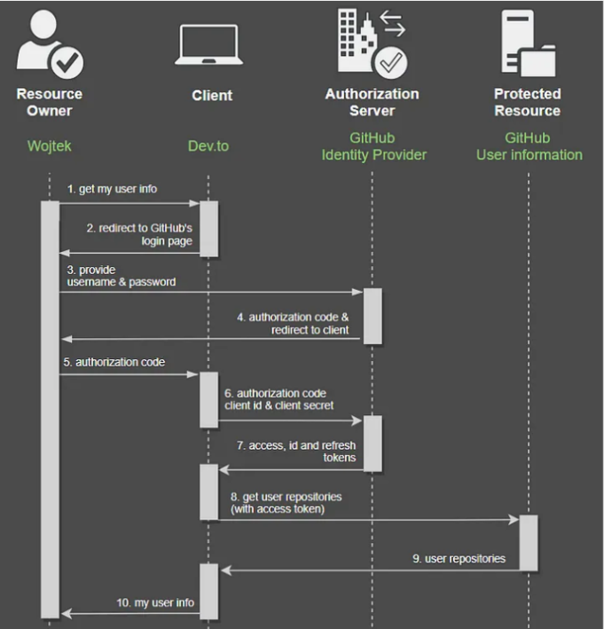
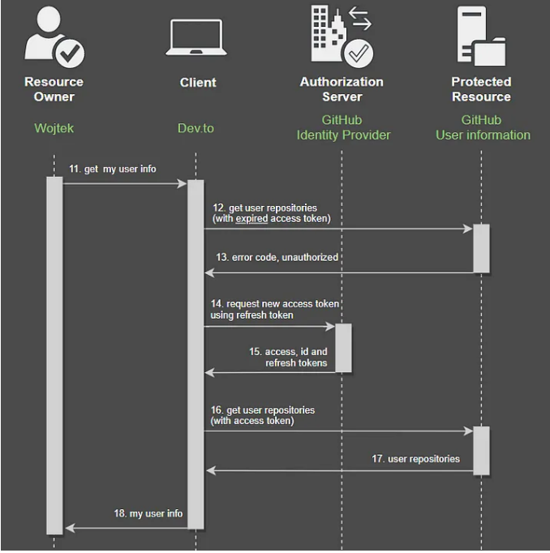

# OAuth2

Keycloak: serviço de gerenciamento de identidade e acesso de código aberto, onde usuários e funções serão definido.
Aplicação backend ( Java, Spring Boot ), terá recursos protegidos (endpoints da API REST) ​​que somente usuários com função específica poderão consumir.
O aplicativo frontend ( Angular ) consumirá o recurso protegido e cuidará da autorização do usuário.

# Passando credenciais para aplicativos de terceiros
Um dos problemas na segurança de um software é como garantir que o sistema A tenha permissão para se conectar ao sistema B.
como garantir que os aplicativos de software tenham autorização para usar um ao outro? No caso da comunicação entre humanos e máquinas, é bem simples. 
O usuário entra em um site/aplicativo móvel e, antes de fazer qualquer coisa, ele pede credenciais válidas.

Mas o que acontece se quisermos ter proteção similar entre dois sistemas? 
Para ilustrar esse problema, vamos supor que gostaríamos de fazer login no Dev.to com uma conta do GitHub?

Uma solução para esse problema seria fornecer suas credenciais do GitHub na página Dev.to. 
Então o Dev.to as passaria (provavelmente criptografadas) para o GitHub para verificar se são válidas. É seguro mostrá-las para outro sistema? alguma parte não confiável poderia salvar essas credenciais e mexer com elas no futuro.

E mesmo que um aplicativo intermediário seja confiável, ainda há alguns casos de uso em que esse software exigiria o armazenamento de credenciais do usuário.

Por exemplo, o que acontece quando uma sessão de usuário do GitHub expira? Uma solução seria pedir as credenciais ao usuário mais uma vez, mas não é muito amigável. 
Outra seria armazenar as credenciais no site Dev.to e enviá-las se necessário, o que é ainda pior, o que é uma violação de segurança.

Se olharmos agora para esses exemplos, veremos que Dev.to (aplicativo cliente) está agindo como um usuário em todos esses casos. 
Ele solicita alguns dados do GitHub (proprietário do recurso) e fornece nome de usuário e senha reais, então, da perspectiva do GitHub, Dev.to não é diferente de um humano. Dev.to está personificando ela ou ele.

E é uma situação potencialmente arriscada, especialmente para aplicativos de cliente não confiáveis, porque com suas credenciais eles ganham acesso 
para fazer qualquer coisa com um recurso. 
Voltando ao nosso exemplo, você provavelmente não quer que Dev.to consiga excluir seus repositórios ou fazer commits. 
Você quer conceder a eles apenas acesso limitado, como ter informações básicas sobre você e talvez ter acesso a uma lista de seus repositórios.

E esta é, entre outras razões, a razão pela qual o protocolo OAuth foi criado.

# Fluxo OAuth 2.0 (da perspectiva do usuário)
digamos que eu gostaria de verificar minha lista de repositórios na página de informações do usuário (atualmente o Dev.to não tem esse recurso, 
mas digamos que ele tem). Portanto, vou para a página de configurações — https://dev.to/settings. 
Acontece que não estou logado, então o Dev.to me redireciona para a página de login.

Durante o registro, escolhi uma opção do GitHub , portanto, agora também preciso escolhê-la. Agora, sou redirecionado para a página de login do Github
O importante é que agora estou na página do GitHub. Quando estou verificando a URL de um site em um navegador, não é mais dev.to , é github.com. 
Então eu poderia ter certeza de que uma credencial que eu forneceria em um segundo não seria vista pelo Dev.to .

Depois de fornecer meu nome de usuário e senha, sou redirecionado novamente para o site Dev.to e posso fazer o que quiser lá.

Agora você pode perguntar:
Como essa mágica é possível? O que mais está acontecendo no fundo.

Vamos nos aprofundar e ver uma imagem completa do fluxo descrito.

# Fluxo OAuth 2.0 (concessão de autorização)
primeiro precisamos apresentar todos os atores (funções) que fazem parte dele.

- Proprietário do Recurso(Resource owner): geralmente é uma pessoa, um usuário. Ela concede acesso ao recurso protegido a um cliente.

- Cliente: é um aplicativo que, em nome de um proprietário de recurso, gostaria de acessar um recurso protegido. 
Um exemplo de tal cliente poderia ser um navegador da web, um aplicativo móvel ou outro aplicativo de terceiros (no exemplo anterior, seria Dev.to ).

- Servidor de autorização: é responsável por verificar a identidade de um usuário e conceder tokens de acesso, 
credenciais necessárias para acessar recursos protegidos por um cliente (explicarei o que são tokens um pouco mais tarde).

- Recurso Protegido: é um aplicativo que um cliente quer acessar (no exemplo anterior seria GitHub ). 
Ele autoriza clientes com base em um token de acesso fornecido pelos clientes.

-------------------------

Vamos supor que eu seja um proprietário de recurso e gostaria de verificar minhas informações de usuário. 
Portanto, vou para a página de configurações — https://dev.to/settings (1). 
Como não estou logado no momento, ele me redireciona para a página de login e eu escolho uma opção do GitHub lá (2).

Agora estou na página do GitHub. O que vale a pena mencionar aqui é o fato de que novos parâmetros foram adicionados à URL básica do GitHub:

client_id: é uma identificação de um aplicativo cliente, que informa ao servidor de autorização ( GitHub neste caso) para qual aplicativo o acesso será concedido.

response_type: indica um tipo de concessão (informa à autorização como gostaríamos de obter o token de acesso, mais sobre isso será descrito ao longo de todo o fluxo), o valor aqui é "code"

scope: representa um conjunto de direitos (qual ação ou recurso será permitido ao cliente fazer) em um recurso protegido, por exemplo, ler , escrever , etc., em nosso exemplo, isso user, email, repo significa que Dev.to gostaria de ter acesso às informações do usuário, endereço de e-mail e repositórios.

state: é uma credencial única, geralmente um texto simples gerado aleatoriamente, necessária para corresponder a uma solicitação do cliente com a resposta do servidor de autorização.

redirect_uri: após o login bem-sucedido, o servidor de autorização redirecionará o usuário para esta página servida pelo aplicativo client

Um exemplo de tal URL seria:
https://github.com/login?client_id=devto_id&response_type=code&scope=user,email,repo&state=sFf4sd&redirect_uri=https://dev.to

Após fornecer meu nome de usuário e senha (3), sou redirecionado novamente para o site Dev.to (4 e 5). 
Mas, desta vez, em uma solicitação do meu navegador para o servidor do cliente, há um novo parâmetro adicionado pelo GitHub à URL, que é um code.

"Code" é uma credencial única que o aplicativo do cliente pode usar para obter o token de acesso do servidor de autorização.

Agora, o Dev.to possui credencial "code" de um proprietário de recurso e junto com o seu próprio (client_id & client_secret) pode fazer uma solicitação ao servidor de autorização do GitHub para obter token de acesso (6)

Como resultado, o aplicativo do cliente obtém um token de acesso (7) (e às vezes tokens de identidade e atualização, explicarei mais sobre eles mais tarde), que agora pode ser adicionado ao Authorizationcabeçalho de uma solicitação ao GitHub para obter meu endereço de e-mail (8).

Finalmente, o Dev.to recebe meu endereço de e-mail (9), combina com outras informações que eles têm em seu banco de dados e me envia a resposta completa (10).

E é isso! Em resumo, é assim que o fluxo do OAuth 2.0 se parece em caso de login.

---------------------------------

# Definição do escopo do usuário
No caso de registro, quando você quiser se conectar ao Dev.to com credenciais do GitHub, há uma etapa adicional neste processo.

Depois de fornecer as credenciais do usuário na página do GitHub , sou solicitado a confirmar a autorização do Dev.to para ter minhas informações de usuário.

Nesta tela, podemos definir a quais recursos, no site do GitHub , podemos conceder acesso para Dev.to. Na imagem acima, diz claramente que apenas o endereço de e-mail (em modo somente leitura) será obtido de lá, o que é um caso real. No meu exemplo, Dev.to também precisaria pedir acesso à lista de repositórios.

Nesta etapa, podemos definir qual escopo, quais informações, gostaríamos de conceder permissão para ler (ou escrever) para um aplicativo cliente. 
Esta decisão é totalmente do proprietário do recurso e dá a ele um controle de quanto poder ele quer dar a um software cliente.

# Concessões de autorização (Authorization grants)
O que foi descrito na seção anterior é chamado de Fluxo de Código de Autorização (Grant) e é um dos vários fluxos definidos no framework OAuth 2.0 . 
Cada um deles descreve como obter o token de acesso (credencial) e pode ser um pouco diferente do que foi apresentado no diagrama anterior. 
Além do fluxo mencionado, há também:

Credenciais do cliente: geralmente usadas na comunicação máquina a máquina quando um humano não está envolvido em nenhuma etapa específica, portanto não há proprietário do recurso.

Fluxo de senha do proprietário do recurso: não recomendado, mas pode ser usado para aplicativos de cliente altamente confiáveis. 
O motivo para isso é que aqui as credenciais do proprietário do recurso são fornecidas ao cliente (Dev.to), que então as passa para o servidor de autorização, o que pode causar uma ponte de segurança,

Fluxo Implícito: inicialmente foi projetado para ser usado para clientes que rodam em um navegador da web (Angular, React, Vue, etc.) no qual o navegador da web de um proprietário de recurso recebeu um token de acesso, então ele/ela precisa armazená-lo em seu lado (por exemplo, no Armazenamento Local do navegador). 
Atualmente, essa abordagem não é recomendada, pois invasores em potencial podem roubar esse token do Armazenamento Local do usuário.

Todos eles são vistos como menos seguros do que o Authorization Code Flow , mas depende muito do cenário. 
E como escolher o certo? Existem alguns lugares onde ele é descrito. Por exemplo, em auth0.com, respondendo a perguntas simples, 
você pode encontrar aproximadamente o mais adequado. 
Também na página mencionada há descrições para cada fluxo, mas se você ainda quiser saber mais, há um ótimo artigo no Medium publicado por Takahiko Kawasaki

# Access token
Na especificação OAuth 2.0 não há orientação sobre como esse token deve ser, o que o torna aberto para implementação personalizada.

Por exemplo, poderia ser apenas uma string simples com caracteres aleatórios: dsXf34x82Sgewr546sd24vac1

Ou poderia ser mais estruturado e protegido criptograficamente. 
A principal vantagem dessa abordagem é o fato de que os tokens podem conter algumas informações úteis em vez de serem apenas um texto aleatório. 
Um exemplo dessas informações poderia ser as permissões do proprietário do recurso. Um dos mais populares, e de fato um padrão, é o JWT.

# JWT

exemplo de JWT:
eyJ0eXAiOiJKV1QiLCJhbGciOiJIUzI1NiJ9.
eyJpc3MiOiJPbmxpbmUgSldUIEJ1aWxkZXIiLCJpYXQiOjE3MjczNjE4MDYsImV4cCI6MTc1ODg5NzgwNiwiYXVkIjoid3d3LmV4YW1wbGUuY29tIiwic3ViIjoianJvY2tldEBleGFtcGxlLmNvbSIsIkdpdmVuTmFtZSI6IkpvaG5ueSIsIlN1cm5hbWUiOiJSb2NrZXQiLCJFbWFpbCI6Impyb2NrZXRAZXhhbXBsZS5jb20iLCJSb2xlIjpbIk1hbmFnZXIiLCJQcm9qZWN0IEFkbWluaXN0cmF0b3IiXX0.
lE4ewWkbPXyL4Nd6SoIxdAprxS0JxSvv4erMdFsr5xM

Se você olhar mais de perto, verá que ele é feito de 3 seções separadas por pontos. que são cabeçalho, carga útil e assinatura. respectivamente

Cada uma dessas seções são JSONs codificados com Base64. A razão para isso é porque os tokens são geralmente transportados em um cabeçalho HTTP, há uma possibilidade de que durante isso alguns dados possam ser modificados (caracteres incomuns, por exemplo). 
Também torna esses JSONs mais compactados, com menos número de caracteres. 
Mas tenha certeza, esse token não é criptografado, então qualquer um pode lê-lo com o decodificador Base64!

Agora, vamos prosseguir para decodificar cada seção do JWT e descobrir o que há dentro dela. Para fazer isso, estou usando um site https://jwt.io .

partes do jwt:
iat(issue at) - informa quando o token foi gerado (Unix Epoch),
exp(expiry) - especifica um registro de data e hora quando o token irá expirar,
iss(emissor) - indica quem criou um token, geralmente é uma URL para o servidor de autorização,
sub(assunto) - informa quem são os dados em uma carga útil, geralmente é uma identificação do proprietário do recurso,
jti(identificador único) - identificador de um token.
alg(algoritmo) - especifica que tipo de algoritmo de assinatura foi usado

# ASSINATURA JWT

O conceito essencial por trás do JWT é o fato de que qualquer um deve ser capaz de ler o conteúdo de um token, mas apenas um servidor autorizado pode criar um válido. 
Portanto, um recurso protegido deve, de alguma forma, verificar se um token está correto. 
Se por algum motivo ele for ignorado, há uma possibilidade de que um cliente não autorizado (ou pior ainda, um programa de malware) crie um token fictício e faça coisas estranhas.

Para evitar que isso aconteça, uma terceira seção foi adicionada ao JWT, chamada signature . Somente com ela podemos ter certeza de que um token está correto.

Mas como isso realmente funciona?

Há várias maneiras de criar uma assinatura válida, mas a abordagem mais comum é combinar o cabeçalho e o payload dos JWTs codificados com um algoritmo secreto e criptográfico. Com base nessas 4 entradas, uma assinatura única pode ser criada.

Assinatura = Criptografia (Cabeçalho + Carga útil + chave secreta)

Se qualquer parte desta equação for modificada (por exemplo, payload), uma assinatura também será alterada. 
E isso só é possível quando você conhece um algoritmo de assinatura (a informação é fornecida no cabeçalho de um JWT) e um segredo.

Dependendo do algoritmo, esses segredos podem ser usados ​​de diferentes maneiras.

--------------------

Primeiro, a abordagem popular para gerar assinatura é com criptografia de chave simétrica — HS256 . 
Nela, temos um único segredo que é compartilhado entre o servidor de autorização (para criar token) e o recurso protegido (para validar uma assinatura). 
A principal desvantagem disso é o fato de que ambas as partes, o servidor de autorização e o(s) recurso(s) protegido(s), precisam ter o mesmo segredo não público. 
Não é um grande problema se ambos forem o mesmo aplicativo ou compartilharem o mesmo banco de dados, mas pode ficar complicado quando os temos como entidades separadas e precisamos copiar e colar com segurança de um para o outro.

Outra abordagem é usar uma assinatura assimétrica RS256 na qual há um par de chaves públicas e privadas. 
Um servidor de autorização tem acesso à chave privada que é usada para gerar uma assinatura. 
Além disso, o servidor de autorização está fornecendo uma chave pública, que não pode ser usada para assinar um JWT, mas pode ser usada por um recurso protegido para verificar se um JWT assinado está correto. 
Uma chave pública pode ser fornecida de várias maneiras, mas geralmente é por ponto de extremidade HTTP, então vários aplicativos podem fazer uso dela.

# Refresh token

Até agora, cobri o fluxo básico do OAuth 2.0, que é obter o token de acesso. 
Na parte sobre JWT, foi mencionado que os tokens têm uma data de expiração, o que significa que depois de um certo tempo eles não serão válidos. 
E geralmente é depois de um curto período de tempo, como alguns minutos.

Para evitar que o cliente peça novamente as credenciais ao proprietário do recurso, um novo tipo de token foi introduzido: token de atualização .

O token de atualização pode ser tratado como uma credencial que pode ser usada para obter o token de acesso, mas desta vez ele não é atribuído ao proprietário do recurso , mas ao cliente , que pode usá-lo para obter um novo token de acesso.

O que é importante, refresh token não é um access token válido e não pode ser enviado do cliente para o protected resource . 
Tecnicamente pode, mas o protected resource deve rejeitá-lo.

Outra diferença fundamental entre ambos os tokens é o tempo de vida. 
Os tokens de acesso geralmente são válidos por alguns minutos, mas um token de atualização pode ser usado por algumas horas ou até mesmo dias.

Aqui está o fluxo de como um token de atualização pode ser usado entre atores do OAuth 2.0:

Voltando ao nosso exemplo, vamos supor que depois de alguns minutos eu gostaria de carregar novamente minha página de informações do usuário no Dev.to. Portanto, eu carrego uma página (11) e o Dev.to precisa obter as informações dos meus repositórios, então, usando um token de acesso que ele já tem do exemplo anterior, ele faz novamente uma solicitação ao recurso protegido (12).

O recurso protegido é então verificar o token e vê que ele expirou, então ele retorna um código de erro para o cliente (13). 
Felizmente, o cliente armazenou um token de atualização e está fazendo uma nova solicitação ao servidor de autorização (14), incluindo um token em um cabeçalho de solicitação.

Como resultado, o servidor de autorização retorna um novo token de acesso e atualização (15) 
(mais, possivelmente, um token de identidade, que será descrito na seção a seguir) para que um cliente possa fazer uma solicitação ao recurso protegido (16) e retornar um resultado final para mim (17, 18).

# Identity Token (Token de identidade)
Se olharmos mais de perto a especificação OAuth 2.0, descobrimos que ela foi projetada para lidar com a concessão de acesso a recursos protegidos, ela descreve o que o usuário/cliente pode fazer e tem acesso (por exemplo, ler, escrever, excluir). 
É impessoal, porque não há informações sobre quem é o usuário. Apenas quais ações podem ser feitas. E isso é chamado de autorização .

Por outro lado, há um conceito de autenticação que valida se um usuário é quem ele/ela diz ser. Não tem nada a ver com quais permissões eles têm.

Voltando ao nosso exemplo anterior com Dev.to e GitHub , digamos que nosso cliente, Dev.to , gostaria de saber algo sobre o usuário que efetuou login. Digamos um endereço de e-mail e onde o usuário está localizado.

Poderíamos fazer isso com uma abordagem semelhante à anterior, usando o token de acesso e fazendo outra chamada ao GitHub para obter o que queremos, mas há outra maneira, adicionando as informações necessárias a um token.

Mas essa é outra maneira que não é descrita no framework OAuth 2.0 pelos motivos mencionados anteriormente, é um framework de autorização e o conteúdo do token de acesso não deve ser analisado por um cliente (no nosso caso Dev.to ). Um token de acesso para um cliente é apenas um jargão, por design ele deve ser analisado apenas pelo recurso protegido .

Para superar essa limitação, uma nova estrutura foi introduzida — OpenID Connect (OIDC) — que é construída sobre o OAuth 2.0 . 
Em outras palavras, o OIDC usa os mesmos fluxos do OAuth 2.0 e os estende com alguns novos recursos.

O mais importante é que se um cliente fizer uma solicitação para obter um token de acesso, ele também receberá um novo — token de identidade (ID token), que contém informações do usuário. Para garantir que as informações estejam corretas, o token de identidade é representado no formato JWT, onde o payload é muito semelhante ao do token de acesso.

E o que vale a pena mencionar é que o token de identidade foi projetado para ser usado somente por um aplicativo cliente e não deve ser usado para obter recursos do recurso protegido .

